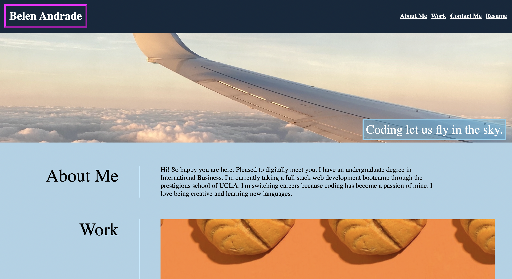
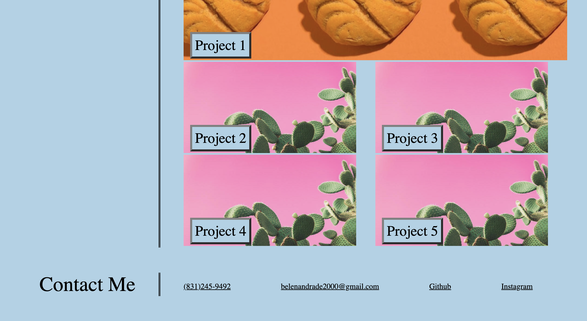

# Interviews-Profile

## Description

In this webpage, there is content about me for potential employers to see my industry potential. The webpage has a header with navigation links to the main body and a main body that includes an "about me" section, a work section showcasting my future projects, and a section that includes my contact information. My motivation for making this webpage is to showcase my skills and my personality to potential employers. Another reason is to stand out from other candidates by showing my coding skills by building a functional webpage. In making this project, I learned that making mistakes is essential to coding.

## Table of Contents

- [Installation](#installation)
- [Usage](#usage)
- [Credits](#credits)
- [License](#license)

## Installation

N/A

## Usage
 
 To use this webpage, simply use the url to navigate to the page. Once inside, you can either scroll through the content or you can click on the header elements to take you to the respective section to learn more about me. There are three main sections. About me, Work, and Contact information. In the contact section, clicking on the Github tab will take you to my Github account. 

## Credits

N/A

## License

Please refer to the Github repository.
